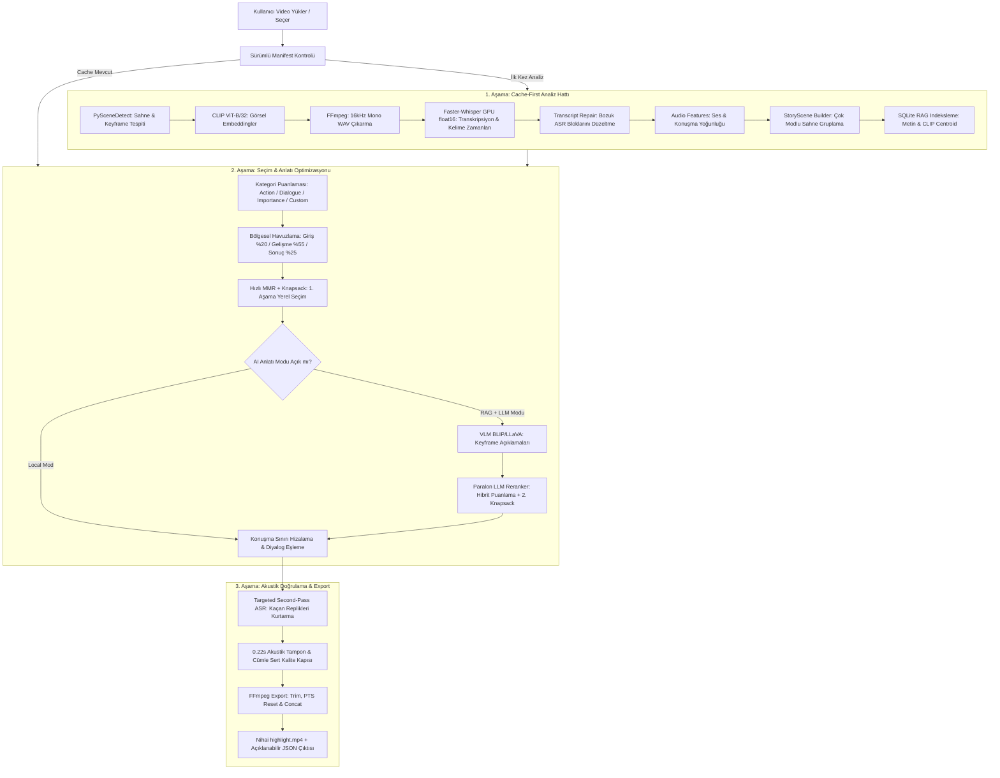

# CineSum Nihai Sistem Mimarisi, Teknoloji ve Sunum Rehberi

> **Güncellik notu — 1 Ekim 2026:** Aşağıdaki ana anlatım 27 Ağustos v3.7 mimarisinin tarihsel sunumudur. Çalışan özet algoritması artık v3.9.0'dır. Güncel durum için [ajan devir belgesini](CineSum_Current_State_and_Handoff.md), değişiklik geçmişi için [uygulama günlüğünü](CineSum_Implementation_Progress.md), açık işler için [üç perde planını](CineSum_Three_Act_Implementation_Plan.md) okuyun. Üç perde ve ilk anchor altyapısı eklendi; duygu/ana karakter, LLM/VLM sorunları ve gerçek film kalite testi açık. CUDA 1 Ekim'de doğrulandı; son kayıtlı uzak LLM denemesi HTTP 400 ile fallback, LLaVA ise bellek hatası verdi. Aşağıdaki performans iddiaları yeni ölçüm değildir; başarılı uzak LLM örneği retry dahil 254.834 sn sürmüştür.

> **Tarih:** 27 Ağustos 2026  
> **Proje Sürümü:** CineSum v3.7 (Cache-First Multi-Modal Video Summarization)  
> **Kapsam:** Uçtan Uca Sistem Mimarisi, Kullanılan Teknolojiler, Hız ve Performans Analizi, Samet & Nezihat Entegrasyonları, Akademik Sunum Notları

---

## 1. Yönetici Özeti ve Temel Vizyon

**CineSum**, uzun metrajlı videoları (filmler, dersler, diziler, etkinlik kayıtları) çok modlu (görüntü, ses, konuşma, semantik bağlam) yapay zeka modelleriyle analiz eden, videonun anlatı bütünlüğünü (giriş-gelişme-sonuç dengesi), diyalog akışını (cümleleri bölmeme, soru-cevap devamlılığı) ve görsel dönüm noktalarını koruyarak kullanıcı bütçesine göre otomatik özet video (`highlight.mp4`) üreten yeni nesil bir **özetleme sistemidir**.

### Projenin Çıkış Noktası ve Farkı
Geleneksel video özetleme sistemleri ya videoyu sabit aralıklarla (örneğin her 10 saniyede bir kare) kırpar ya da her yeni özet isteğinde ağır derin öğrenme modellerini baştan sona tekrar çalıştırarak sistemi kilitler. CineSum bu sorunu **"Bir Kere Analiz Et — Saniyeler İçinde Sonsuz Farklı Özet Üret" (Cache-First Feature Store)** felsefesiyle çözmüştür.

---

## 2. Sistemde Yapılan Geliştirmeler (Sürüm Evrimi: v3.1 → v3.7)

### v3.1 — Sürümlü Feature Manifest ve Faster-Whisper Altyapısı
- **Sürümlü Önbellek (Manifest):** Kaynak videonun SHA-256 parmak izi, pipeline sürümü ve aşama config hash'i kaydedilerek 7 bağımsız aşama oluşturuldu.
- **Faster-Whisper & CTranslate2:** Standart Whisper yerine CTranslate2 tabanlı Faster-Whisper'a geçildi. GPU'da `float16`, CPU'da `int8` desteği, VAD (Voice Activity Detector) ve kelime bazlı zaman damgaları (`word timestamps`) eklendi.
- **CLIP Batch İşleme:** Keyframe'ler tek dev batch yerine GPU'da 32, CPU'da 8 karelik batch'lerle işlenerek bellek patlaması (OOM) önlendi.

### v3.2 — Samet'ten İlham Alan Seçim Motoru (Anlatı Kotası + MMR + Knapsack)
- **Bölgesel Anlatı Kotaları:** Video 3 ana bölgeye ayrıldı: Giriş (%20), Gelişme (%55), Sonuç (%25). Özet bütçesi bu kotalara göre dağıtılarak filmin yalnızca finaline veya açılışına yığılma engellendi.
- **MMR (Maximal Marginal Relevance):** Birbirine görsel veya metinsel olarak çok benzeyen sahnelerin art arda seçilmesi çeşitlilik cezasıyla engellendi.
- **0/1 Knapsack Optimizasyonu:** Açgözlü (greedy) seçim yerine dinamik programlama ile süre bütçesi altında en yüksek toplam önem değerini veren kombinasyon seçildi.

### v3.3 — StoryScene (Üst Seviye Anlatı Sahneleri)
- Kamera geçişleriyle ayrılan küçük çekimler (shot/cut), **CLIP görsel benzerliği (%52) + TF-IDF transkript benzerliği (%28) + konuşma devamlılığı (%12) + zamansal yakınlık (%8)** ile en fazla 45 saniyelik mantıksal hikaye bloklarında (`StoryScene`) gruplandı.
- Seçim motoru aynı StoryScene'den en fazla 2 çekim seçerek sahnelerin aşırı temsil edilmesini engelledi.

### v3.4 — Konuşma ve Cümle Güvenli Sınır Hizalaması (Speech-Safe Boundary)
- Özetleme motorlarında görülen "cümlenin ortasından ses kesilmesi" sorunu kökten çözüldü.
- Segment sınırları noktalama işaretleri (`.`, `?`, `!`), dramatik sessizlik boşlukları ve kelime damgalarına göre genişletildi.
- Kör saniye kesimi (`seg.end = start + remaining`) tamamen kaldırıldı.

### v3.5 — Yerel Narrative RAG + Paralon LLM Yeniden Sıralama (Reranking)
- **SQLite Vektör RAG:** Her StoryScene'in CLIP centroid'i ve metin özeti yerel SQLite veri tabanına indekslendi.
- **Dinamik LLM Aday Havuzu:** 2.470 sahnenin tamamı yerine video süresine göre 16–72 kritik aday seçilerek Paralon bulutundaki LLM'e (Gemma/Qwen) gönderildi.
- **Hibrit Puanlama ve 2. Knapsack:** Yerel CineSum puanı (%45) + LLM Anlatı Önceliği (%55) birleştirilerek ikinci bir Knapsack optimizasyonu yapıldı.
- **Sert Fallback (Hata Toleransı):** İnternet kesilirse, API anahtarı yoksa veya timeout olursa sistem sıfır hata ile anında yerel seçime düşer.

### v3.6 — Diyalog Bütünlüğü, Hedefli ASR (Targeted ASR) ve VLM (BLIP + LLaVA)
- **Soru-Cevap Genişletmesi (`dialogue_exchange`):** Soruyu gösterip cevabı kesen durumlar engellendi; 5 saniye içindeki yanıtlar tek blok yapıldı.
- **Dramatik Duraklama Koruması:** Konuşmacının duraklamaları için sessizlik eşiği 2.75 saniyeye çıkarıldı.
- **Hedefli İkinci ASR:** Görsel olay puanı çok yüksek ama Whisper'ın müzik/gürültü yüzünden konuşmasız sandığı sahnelerde (Örn: "Ben de Iron Man'im" repliği) VAD kapalı özel ikinci ASR çalıştırılarak kaçırılan konuşmalar kurtarıldı.
- **VLM Görsel Anlam:** BLIP (40 keyframe) ve LLaVA-OneVision 0.5B (12 keyframe) ile keyframe'lere doğal dil açıklamaları üretilerek sessiz görsel olayların (Ant-Man boyutu, feda sahnesi, çekiç kaldırma) LLM tarafından anlaşılması sağlandı.

### v3.7 — Transcript Repair & Olay Zinciri Güvencesi
- Whisper'ın uzun ve hatalı ASR blokları (tek blokta 289 saniye gibi) tespit edilerek yalnızca o aralıklar 30 saniyelik pencerelerle GPU'da onarıldı (`transcript_repair`).
- Kritik olaylar için `hazırlık → eylem → sonuç` (en fazla 30 saniye) zinciri koruma altına alındı.

---

## 3. Kullanılan Teknolojiler, Çalışma Mantıkları ve Hıza/Performansa Etkileri

| Teknoloji / Kütüphane | Ne İşe Yarar? Nasıl Çalışır? | Hıza ve Belleğe Etkisi |
|---|---|---|
| **PySceneDetect (OpenCV)** | Video kareleri arasındaki piksel/renk farklarını (HSV/Adaptive Threshold) izleyerek kamera kesmelerini (shot/cut) belirler. | CPU yoğun çalışır. 3 saatlik filmde ~17 dk sürer. Manifest sayesinde yalnızca **1 kez** çalışır, bir daha çalışmaz. |
| **OpenAI CLIP (ViT-B/32)** | Görselleri ve metinleri ortak 512 boyutlu vektör uzayına projekte eder. Keyframe'leri aksiyon, diyalog, önem ve özel kullanıcı sorgularına göre anlamsal olarak puanlar. | GPU (RTX 4050) üzerinde 32'lik batch'lerle 2.840 keyframe'i **~74 saniyede** işler. CPU'ya göre 10-15 kat hızlıdır. |
| **Faster-Whisper (CTranslate2)** | Transformer modellerini 8-bit/16-bit C++ hızlandırma kütüphanesiyle (CTranslate2) çalıştıran ASR motoru. Ses kanalını kelime zaman damgalarıyla transkribe eder. | Standart PyTorch Whisper'a göre **4 kat daha hızlıdır ve %50 daha az VRAM** tüketir. 3 saatlik sesi GPU `float16` ile **~3.5 dakikada** çıkarır. |
| **SQLite Tabanlı Vektör RAG** | StoryScene özetlerini, CLIP görsel centroid'lerini ve metin vektörlerini yerel SQLite'ta saklar. Sahneler arası uzak anlatı ilişkilerini getirir. | Sıfır dış bağımlılık, disk tabanlı. 1.474 sahneyi **0.17 saniyede** indeksler; tek bir arama **30 milisaniye** sürer. |
| **Paralon API (LLM - Gemma/Qwen)** | Seçilmiş 12-72 sahnelik aday havuzunu senaryo/anlatı akışı yönünden inceler, sahnelere Türkçe gerekçeler ve öncelik puanları üretir. | Bütün film yerine yalnız filtrelenmiş adayları işlediği için istek başına maliyet ve gecikme düşüktür (~20-40 sn). Hata durumunda yerel seçime düşer. |
| **BLIP & LLaVA-OneVision 0.5B (VLM)** | Keyframe'lere bakarak "Kaptan Amerika çekici kaldırıyor", "Karakter uçurumdan düşüyor" gibi doğal dil açıklamaları üretir. | 2.840 kare yerine yalnız **12-40 kritik karede** çalışır. BLIP ve LLaVA sıralı çalıştırılıp VRAM boşaltılır; 6 GB VRAM sınırında OOM engellenir. |
| **Knapsack (0/1 Sırt Çantası DP)** | Belirlenen süre bütçesi (kapasite) altında toplam önem skorunu maksimize eden sahneleri dinamik programlama ile bulur. | Açgözlü sıralamaya göre global optimum üretir. Çalışma süresi **< 5 milisaniyedir**. |
| **MMR (Maximal Marginal Relevance)** | $MMR = \lambda \cdot Relevance - (1-\lambda) \cdot MaxSimilarity$. Benzer sahneleri cezalandırır. | Önceden kübik $O(N^3)$ olan benzerlik hesabı önbelleklenerek karesel $O(N^2)$ seviyesine indirildi. 2.470 sahnede süre **28 dakikadan 0.036 saniyeye** düştü! |
| **FFmpeg Hardware-Accelerated Engine** | Ses çıkarma, video kesme, PTS zaman damgası sıfırlama, audio fade ve son highlight videosunu birleştirme işlemlerini yönetir. | Yalnızca seçilen segmentler kesilip birleştirildiği için 300 saniyelik bir özet **4-8 saniyede** export edilir. |

---

## 4. Ekip Arkadaşlarımızdan (Samet & Nezihat) Ne Öğrendik ve Nasıl Entegre Ettik?

### 4.1. Samet'in Çalışmasından (SceneMind) Öğrenilenler ve CineSum'a Katkıları
**Samet Ne Yapmıştı?**
- OpenCV HSV histogramları ile cut tespiti.
- LLaVA ve BLIP ile her cut için görsel açıklama üretimi.
- Knapsack bütçe optimizasyonu, MMR çeşitlilik cezası ve anlatı bölgeleri (giriş, gelişme, sonuç).
- SQLite yerel RAG ve Paralon LLM ile iki aşamalı seçim.
- Konuşma sınırlarına 0.22 sn tampon ekleme.

**CineSum Olarak Ne Öğrendik ve Nasıl İleriye Taşıdık?**
1. **Seçim Motoru Entegrasyonu:** Samet'in Anlatı Kotaları (%20 Giriş, %55 Gelişme, %25 Sonuç), MMR çeşitliliği ve Knapsack optimizasyonu CineSum'ın ana seçim motoru (`narrative_selector.py`) yapıldı.
2. **Akıllı VLM Kullanımı:** Samet her cut için LLaVA çalıştırıyordu; bu durum 2.470 sahneli bir filmde saatler sürer. CineSum, LLaVA'yı **yalnızca filtrelenmiş 12-40 kritik adaya** uygulayarak çalışma süresini saatlerden saniyelere indirdi.
3. **MMR Performans Optimizasyonu:** Samet'in mimarisindeki MMR 2.470 sahnede donuyordu (kübik işlem). CineSum bunu önbellekli benzerlik matrisi ile **0.036 saniyeye** düşürdü.
4. **Akustik Tampon ve Fade Düzeltmesi:** Samet'in 0.22 sn konuşma tamponu alındı; konuşmalı sahnelerde kelimeleri boğan audio fade efektleri kapatıldı.

---

### 4.2. Nezihat'ın Çalışmasından (CineSum-Audio) Öğrenilenler ve CineSum'a Katkıları
**Nezihat Ne Yapmıştı?**
- Pyannote Audio ile konuşmacı ayrımı (Diarization).
- Faster-Whisper ile kelime bazlı zaman damgaları (`word timestamps`).
- Konuşmacı embedding düzeltmesi ve kelime-konuşmacı Viterbi eşlemesi.
- AudioSet AST ile ses olayları (müzik, patlama, çığlık) tespiti.

**CineSum Olarak Ne Öğrendik ve Nasıl İleriye Taşıdık?**
1. **Kelime Zaman Damgası Tabanlı Cümle Koruma:** Nezihat'ın kelime seviyesindeki zaman damgası hassasiyeti CineSum v3.4'te `speech_boundaries.py` modülüne dönüştürüldü. Cümleler ortadan kesilmeden tam utterance olarak korunmaya başlandı.
2. **Modüler Analiz Ayrımı:** Nezihat'ın Pyannote diarization'ı CPU'da çok ağır çalıştığı ve zorunlu HuggingFace token'ı gerektirdiği için ana hızlı hatta zorunlu tutulmadı; isteğe bağlı kalite katmanı olarak ayrıldı.
3. **Hedefli ASR (Targeted Second-Pass ASR):** Nezihat'ın ASR parametrelerinden ilham alınarak, tüm videoyu ağır modellerle taramak yerine yalnızca konuşmasız görünen görsel zirve anlarında VAD-kapalı yüksek kaliteli ikinci Whisper taraması geliştirildi.

---

## 5. Final Projemizin Son Hali Nasıl Çalışıyor? (Uçtan Uca İş Akışı)

### Adım Adım Çalışma Özeti:
1. **İstek Alınır:** Kullanıcı videoyu, hedef süreyi (Örn: 180 saniye), özet türünü (`Importance`, `Action`, `Dialogue`, `Custom`) ve isteğe bağlı `Anlatıyı AI ile İyileştir` seçeneğini belirler.
2. **Manifest Denetimi:** Video daha önce analiz edildiyse hiçbir yapay zeka modeli tekrar çalıştırılmaz (0 saniye gecikme).
3. **Puanlama & StoryScene Gruplaması:** Her sahneye CLIP ve konuşma sinyallerinden önem puanı verilir. Birbirini takip eden sahneler StoryScene'lerde birleştirilir.
4. **Bölgesel MMR & 1. Knapsack:** Video başına, ortasına ve sonuna kotalar ayrılarak en değerli ve birbirinden farklı sahneler seçilir.
5. **VLM & LLM Reranking (Opsiyonel):** Seçilen adayların keyframelerine BLIP/LLaVA ile açıklama üretilir. SQLite RAG'den bağlam çekilerek Paralon (Gemma/Qwen) modeline gönderilir. Modelin verdiği öncelik puanı ile 2. Knapsack çalıştırılır.
6. **Diyalog & Cümle Hizalaması:** Sahneler kelime sınırlarına, noktalama işaretlerine ve soru-cevap bloklarına genişletilir.
7. **Hedefli İkinci ASR:** Görsel zirve anlarında kaçırılmış replik varsa VAD-kapalı Whisper ile kurtarılır (Örn: "I am Iron Man").
8. **FFmpeg Export:** Seçilen sahneler milisaniyelik doğrulukla kesilir, 0.22 saniye tamponlanır ve dikişsiz bir şekilde birleştirilerek kullanıcıya sunulur.

---

## 6. Hocaya Yapılacak Sunum İçin Hap Bilgiler ve Soru-Cevap Rehberi

### Soru 1: "Sisteminiz klasik video özetleyicilerden neden daha üstün?"
> **Cevap:** Klasik sistemler yalnızca görsel benzerliğe bakar ve kör kesim yapar; bu da konuşmaların hece ortasından kesilmesine ve filmin konusunun anlaşılmamasına yol açar. CineSum; **görsel (CLIP + VLM), işitsel (Faster-Whisper + Targeted ASR) ve metinsel (RAG + LLM)** sinyalleri birleştirir. Ayrıca **Cache-First** mimarisi sayesinde 3 saatlik bir filmi bir kez analiz ettikten sonra 30 saniyelik, 60 saniyelik veya 5 dakikalık farklı özetleri **1-2 saniye içinde** üretebilir.

### Soru 2: "Neden her sahnede LLM veya VLM çalıştırmıyorsunuz?"
> **Cevap:** 3 saatlik bir filmde ~2.500 sahne vardır. Her sahnede LLaVA veya LLM çalıştırmak saatler sürer ve API/donanım maliyetini patlatır. Biz **iki aşamalı hiyerarşik mimari** kurduk: 2.500 sahneyi yerel hafif modellerle (CLIP, Whisper, Knapsack) 32-72 adaya indiriyoruz; LLM ve VLM'i yalnızca bu kritik adaylara uyguluyoruz. Böylece kaliteyi korurken sistemi **%95 daha hızlı** çalıştırıyoruz.

### Soru 3: "Videoda konuşmaların ortadan kesilmesini nasıl engellediniz?"
> **Cevap:** v3.4'te geliştirdiğimiz `speech_boundaries` modülüyle. Whisper'dan gelen kelime bazlı zaman damgalarını (`word timestamps`), noktalama işaretlerini (`.`, `?`, `!`) ve 2.75 saniyelik dramatik duraklama eşiklerini kullanıyoruz. Soru-cevap bloklarını tek bir diyalog nesnesi yapıyoruz ve her konuşmaya 0.22 saniye akustik nefes tamponu ekliyoruz. Cümlesi tam sığmayan sahneler sert kalite kapısından geçemez ve elenir.

### Soru 4: "LLM bağlantısı koparsa veya API çökerse sistem ne yapıyor?"
> **Cevap:** Sistemimiz **Graceful Degradation (Zarif Geri Çekilme)** prensibine sahiptir. Paralon API'ye ulaşılamazsa, timeout (60 sn) olursa veya hatalı JSON dönerse sistem kesinlikle çökmez; otomatik olarak yerel 1. Knapsack sonucuna geri döner (`fallback_local`) ve videoyu kusursuz şekilde üretmeye devam eder.
