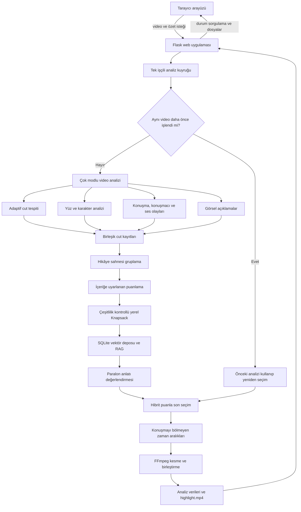

# SceneMind Proje Mimarisi ve Çalışma Mantığı

Bu belge, SceneMind'in kod yapısını ve bir videonun yüklenmesinden özet videonun üretilmesine kadar sistemin nasıl çalıştığını açıklar. Açıklamalar mevcut kaynak kod esas alınarak hazırlanmıştır.

## 1. Projenin amacı

SceneMind, uzun bir videoyu yalnızca zamana göre parçalayan bir araç değildir. Videoyu görüntü, konuşma, ses olayı ve yüz bilgileri üzerinden analiz eder; kamera kesmelerini daha büyük anlatı sahnelerine dönüştürür; ardından kullanıcının süre ve içerik isteğine en uygun parçaları seçerek bir özet video üretir.

Sistemin temel çıktıları şunlardır:

- Kamera kesmeleri ve her kesmenin ana karesi
- Ana karelerin görsel açıklamaları
- Zaman kodlu konuşma dökümü
- Yaklaşık konuşmacı ve karakter kümeleri
- Müzik, bağırma, patlama gibi ses olayları
- Birbiriyle ilişkili cut'lardan oluşan üst seviye hikâye sahneleri
- Her cut için önem puanı ve seçim gerekçesi
- Süre bütçesine uyan `highlight.mp4`

## 2. Üst seviye mimari



Mimari üç ana katmana ayrılır:

1. **Sunum ve iş yönetimi:** Flask API, tek sayfalık arayüz, iş kuyruğu, iptal ve geçmiş yönetimi.
2. **Analiz ve seçim:** Görüntü/ses/yüz analizi, embedding, puanlama, RAG ve sahne seçimi.
3. **Kalıcı çıktılar:** Her iş için JSON, kareler, portreler, embedding'ler, SQLite veritabanı ve özet video.

## 3. Ana dizin yapısı

```text
samet/
├── scene_captioner/
│   ├── web_app.py             Flask API, iş kuyruğu, cache ve durum yönetimi
│   ├── analyzer.py            Ana analiz ve özetleme orkestrasyonu
│   ├── scene_detector.py      Adaptif kamera kesmesi ve ana kare çıkarma
│   ├── audio_analysis.py      Ses çıkarma, Whisper, konuşmacı ve ses olayı analizi
│   ├── face_analysis.py       YuNet/SFace ile yüz bulma ve karakter kümeleme
│   ├── captioners.py          LLaVA, BLIP, Gemini ve diğer görsel açıklayıcılar
│   ├── scene_rag.py           SQLite vektör deposu ve Paralon destekli seçim
│   ├── templates/index.html   HTML, CSS ve JavaScript içeren tek sayfalık arayüz
│   ├── pipeline.py            Basit CLI kare-açıklama hattı
│   ├── frame_extractor.py     CLI için sabit aralıklı kare çıkarıcı
│   └── cli.py                 Basit kare açıklama komut satırı arayüzü
├── scripts/download_models.py Yerel modelleri proje içine indirir
├── models/                    Yerel model dosyaları; Git dışında tutulur
├── outputs/web/               Web işlerinin yükleme ve çıktı alanı
├── tests/test_core.py         Temel analiz, seçim, RAG ve web testleri
├── start_video_ui.sh          Linux/macOS başlatıcısı
└── start_video_ui.bat         Windows başlatıcısı
```

### İki farklı çalışma hattı

Kodda benzer görünen fakat farklı amaç taşıyan iki hat vardır:

- **Ana ürün hattı:** `web_app.py` içinden `analyze_video()` çağrılır. Adaptif cut, ses, yüz, RAG, seçim ve video üretimi bu hatta çalışır.
- **Basit CLI hattı:** `cli.py → pipeline.py → frame_extractor.py` zinciri videodan sabit saniye aralıklarıyla kare çıkarıp yalnız görsel açıklama üretir. Tam SceneMind analizini çalıştırmaz.

Yeni özelliklerin büyük bölümü ana ürün hattında, yani `analyzer.py` çevresinde geliştirilmelidir.

## 4. Web katmanı ve iş yaşam döngüsü

`scene_captioner/web_app.py`, uygulamanın HTTP giriş noktasıdır. Sunucu yalnızca `127.0.0.1:7860` üzerinde açılır ve yüklenen dosya boyutunu 8 GB ile sınırlar.

### API uçları

| Uç | Görev |
|---|---|
| `GET /` | Ana arayüzü döndürür. |
| `GET /api/models` | Yerel modellerin ve Paralon ayarının hazır olup olmadığını bildirir. |
| `POST /api/process` | Videoyu kaydeder, isteği doğrular ve işi kuyruğa ekler. |
| `GET /api/jobs/<job-id>` | Güncel iş durumunu ve kademeli analiz sonucunu döndürür. |
| `POST /api/jobs/<job-id>/cancel` | İptal işaretini etkinleştirir. |
| `GET /api/history` | Önceki işleri listeler. |
| `GET /outputs/...` | Kare, portre ve özet gibi üretilen dosyaları sunar. |
| `GET /uploads/...` | Yüklenen kaynak videoyu sunar. |
| `POST /api/shutdown` | Yalnız yerel istemciden uygulamayı kapatır. |

İşler `ThreadPoolExecutor(max_workers=1)` ile sırayla çalışır. Böylece aynı anda birden fazla ağır model GPU ve belleği paylaşmaya çalışmaz. Flask istekleri ayrı thread'lerde cevap vermeye devam ederken analiz arka planda yürür.

Bir işin durumları şöyledir:

```text
queued → running → complete
                 ↘ error
                 ↘ cancelling → cancelled
```

Arayüz iş durumunu yaklaşık 1,3 saniyede bir sorgular. Analiz aşamaları ilerledikçe `state.json` güncellenir; bu nedenle işlem tamamlanmadan bulunan cut'lar, konuşmalar ve açıklamalar ekranda gösterilebilir.

### Aynı video için cache

Yüklenen dosyanın SHA-256 özeti hesaplanır. Aynı içerik daha önce başarıyla analiz edilmişse pahalı görüntü, ses ve yüz analizleri tekrarlanmaz. Önceki kareler ve portreler yeni iş dizinine hard-link veya kopya olarak alınır; embedding'ler ve sahne verileri kullanılarak yeni kullanıcı isteği ve yeni süre oranı için seçim tekrar yapılır.

Bu yaklaşım, dosya adı değişse bile aynı video içeriğini tanır.

## 5. Ana analiz hattı

Ana orkestrasyon `scene_captioner/analyzer.py` içindeki `analyze_video()` fonksiyonudur.

### 5.1 Adaptif cut tespiti

`scene_detector.py` videoyu OpenCV ile tarar:

1. Yaklaşık saniyede 4 kare örneklenir.
2. Kare `160x90` boyutuna küçültülür.
3. HSV renk uzayında `24x16` histogram çıkarılır.
4. Ardışık histogramların Bhattacharyya uzaklığı hesaplanır.
5. Eşik videonun kendi medyan ve MAD dağılımından bulunur.

```text
eşik = clamp(medyan + max(0.08, 5.5 × MAD), 0.20, 0.72)
```

Bir cut en az 1,25 saniye sürer. Çok uzun ve durağan bölümler en fazla 30 saniyelik parçalara ayrılır. Ana kare, geçiş efektlerinden uzak durmak için cut'ın yaklaşık `%55` noktasından alınır.

Temel analiz birimi `SceneResult` nesnesidir. Bu nesne zaman aralığını, kare yolunu, açıklamayı, konuşmaları, karakterleri, ses olaylarını, puanı ve seçim gerekçelerini birlikte taşır.

### 5.2 Yüz ve karakter analizi

Yüz analizi ses analizinden önce yapılır; çünkü ekranda tek bir karakter olduğunda bu bilgi konuşmacı kümelemesine ipucu olarak verilebilir.

- YuNet yüzleri bulur.
- SFace her yüz için normalize bir embedding üretir.
- Ana kareye ek olarak video büyüklüğüne göre cut içinden ek örnekler alınır.
- Agglomerative clustering benzer yüzleri aynı kimlik altında toplar.
- Aynı örnek karede birlikte görülen iki yüzün tek kişiye birleşmesi engellenir.
- Profil ve cepheden görünüm yüzünden ayrılmış kümeler kontrollü bir ikinci geçişle birleştirilebilir.
- En kaliteli yüz örneği portre seçilir.

Sonuçlar gerçek kişi adları değildir; `Oyuncu 1`, `Oyuncu 2` gibi video içi kimliklerdir. Ekran süresi, karakterin görüldüğü örneklerin cut süresindeki payından yaklaşık olarak hesaplanır.

### 5.3 Ses, konuşma ve konuşmacılar

`audio_analysis.py` aşağıdaki işleri yapar:

1. FFmpeg ile videodan 16 kHz mono PCM WAV çıkarır.
2. Faster-Whisper Small ile VAD destekli zaman kodlu konuşma dökümü üretir.
3. Repliklerden MFCC, delta ve delta-delta özellikleri çıkarır.
4. Agglomerative clustering ile sesleri `Konuşmacı N` kümelerine ayırır.
5. Tek bir karakterin ekranda olduğu anları konuşmacı/karakter eşleştirmesinde yardımcı sinyal olarak kullanır.
6. Çok kısa repliklere en yakın güvenilir repliğin konuşmacısını verir.

Web hattında Whisper CPU üzerinde `int8` çalışır. Dil varsayılan olarak otomatik algılanır.

AudioSet AST modeli ayrıca her cut'ın merkezinden en fazla 7 saniyelik ses penceresi inceler. Toplam iş yükünü sınırlamak için en çok 96 pencere işlenir. Patlama, silah, çığlık, bağırma, ağlama, kahkaha, müzik ve araç gibi seçili olaylar Türkçe etiketlerle kaydedilir.

### 5.4 Görsel açıklama

Her cut'ın ana karesi varsayılan olarak yerel LLaVA 0.5B modeliyle açıklanır. Amaç insanları, mekânı ve görünen eylemi tek somut cümlede ifade etmektir.

Model yanıtı çok kısa, geçersiz veya ret metniyse ikinci bir istem denenir. O da sonuç vermezse genel bir açıklama yazılır. Model seçimi kullanılabilir GPU belleğine göre GPU veya CPU'ya yönlendirilir; her ağır model aşamasından sonra bellek temizlenir.

`captioners.py` ortak bir `Captioner` arayüzü altında mock, BLIP, BLIP-2, LLaVA, Video-LLaVA ve Gemini uygulamalarını içerir. Ana web akışı LLaVA kullanır; diğerleri daha çok CLI ve geliştirme seçenekleridir.

## 6. Cut ile hikâye sahnesi arasındaki fark

- **Cut:** Kamera geçişiyle ayrılan temel teknik birimdir.
- **Hikâye sahnesi:** Ardışık ve anlam, görünüm veya karakter bakımından devamlılık gösteren bir ya da daha fazla cut grubudur.

Komşu cut'ların devamlılığı şu ağırlıklarla hesaplanır:

```text
%52 metin embedding benzerliği
%25 görsel histogram benzerliği
%23 karakter örtüşmesi
```

Grup en az 8 saniyeyse ve devamlılık `0.40` altına düşerse yeni hikâye sahnesi başlar. Jenerik durumu değiştiğinde veya grup 72 saniyeye ulaştığında da sınır açılır. Bu yöntem sabit bir senaryo/perde şablonu varsaymaz; videoda gözlenen içerik değişimini izler.

## 7. Embedding ve puanlama mantığı

Her cut için şu bilgiler tek metinsel temsil içinde birleştirilir:

- Hikâye sahnesinin kısa anlamsal özeti
- Görsel açıklama
- Cut içindeki konuşma
- Komşu cut'ların konuşma bağlamı
- Ses olayları

Normal durumda çok dilli MiniLM normalize embedding üretir. Model yoksa TF-IDF fallback'i kullanılır. Görsel benzerlik için de ana kareden `16x16` HSV histogram vektörü çıkarılır.

### İçeriğe uyarlanan ağırlıklar

Sistem önce videonun gözlenebilir profilini çıkarır: aksiyon ağırlıklı, atmosferik, çok karakterli, diyalog ağırlıklı veya karma. Puan ağırlıkları bu profile göre değişir. Karma profilin varsayılan dağılımı şöyledir:

| Sinyal | Puan |
|---|---:|
| Konuşma yoğunluğu | 24 |
| Önemli ses olayı | 16 |
| Karakter görünürlüğü | 16 |
| Görsel değişim | 12 |
| Semantik özgünlük | 21 |
| Olay yapısı ve sınırı | 11 |

Örneğin aksiyon ağırlıklı videoda ses ve görsel değişim; diyalog ağırlıklı videoda konuşma; atmosferik videoda görsel değişim ve semantik özgünlük daha yüksek ağırlık alır.

Kullanıcı bir özet istemi, sahne türü veya karakter rolü verdiğinde temel sinyaller toplam puanın `%65`'ine ölçeklenir; kalan 35 puan kullanıcı isteğine uygunluğa ayrılır. `strict` seçeneğinde açık filtreye uymayan cut'lar aday havuzundan çıkarılır.

Jenerik olma olasılığı yüksek cut'lara ceza uygulanır. Olasılık `0.72` veya üzerindeyse cut seçime alınmaz. Aynı hikâye sahnesindeki çok benzer tekrarlar da azalan getiri cezası alır; aksiyon sahnelerinde ilk üç, diğer sahnelerde ilk iki güçlü temsilci bu cezadan muaftır.

## 8. Sahne seçimi: yerel algoritma, RAG ve LLM

Özet süresi şu şekilde belirlenir:

```text
süre bütçesi = toplam video süresi × kullanıcının özet oranı
```

Web arayüzü oranı `%5` ile `%25` arasında kabul eder.

### 8.1 İlk yerel seçim

Her cut'ın değeri önem puanı, maliyeti ise konuşma güvenli sınırlarla hesaplanan yaklaşık saniye değeridir. 0/1 Knapsack, bütçe altında toplam değeri en yüksek kümeyi bulur.

Bu seçimin üzerine yumuşak çeşitlilik kontrolü uygulanır:

- Video on zaman penceresine ayrılır; tek bir pencerenin bütçeyi aşırı doldurması azaltılır.
- Aynı hikâye sahnesinin seçimi kaplaması azaltılır.
- Boş veya zayıf bir zaman bölümünden zorunlu sahne seçilmez.

Dolayısıyla sistem sabit başlangıç-orta-son kotası veya üç perde varsayımı kullanmaz.

### 8.2 Yerel RAG deposu

`scene_rag.py`, her iş için `scene_rag.sqlite3` oluşturur. Cut ve hikâye sahnesi belgeleri şu verileri saklar:

- Başlık ve zaman aralığı
- Görsel açıklama
- Karakterler
- Konuşmalar
- Ses olayları
- Komşu cut bağlamı
- Metadata ve normalize embedding

Benzerlik araması cosine benzerliğiyle doğrudan SQLite içindeki vektör BLOB'ları üzerinde yapılır. Bu ölçek için ayrı bir vektör veritabanı sunucusu gerekmez.

### 8.3 Paralon değerlendirmesi

İlk Knapsack sonucu, güçlü yerel adaylar, yakın komşular ve RAG ile ilişkili cut'lar bir aday havuzu oluşturur. Adaylar altılı gruplar halinde ParalonCloud'a gönderilir ve en fazla sekiz istek paralel yürütülür.

Modelden her aday için 1–100 arasında anlatısal öncelik, kısa gerekçe ve birlikte gerekli olabilecek bağlam cut'ları istenir. Ana model yanıt vermezse yalnız başarısız grup için daha küçük fallback model denenebilir.

Nihai değer şu şekilde birleştirilir:

```text
hibrit puan = yerel puan × 0.42 + Paralon önceliği × 0.58
```

Son seçim yine yerel çeşitlilik kontrollü Knapsack ile yapılır. Böylece LLM anlatı bağını yorumlar, fakat süre sınırını doğrudan yönetmez. Paralon yapılandırılmamışsa, yanıt geçersizse veya servis kullanılamazsa ilk yerel seçim korunur; analiz tamamen durmaz.

## 9. Konuşmayı bölmeden özet üretme

Seçilmiş cut'ın başı veya sonu bir repliğin ortasına denk gelirse sınır repliğin tamamını kapsayacak şekilde genişletilir ve küçük bir tampon eklenir. Örtüşen ya da birbirine çok yakın aralıklar birleştirilir.

FFmpeg tek bir `filter_complex` grafiğiyle seçilen aralıkları işler:

- Görüntü: `trim` ve `setpts`
- Ses: `atrim` ve `asetpts`
- Birleştirme: `concat`
- Video kodlama: H.264, `veryfast`, CRF 23
- Ses kodlama: AAC
- Web oynatımı: `+faststart`

Kaynak videoda ses akışı yoksa yalnız görüntü hattı oluşturulur.

## 10. Veri modeli ve üretilen dosyalar

Her web işi benzersiz bir UUID ile şu dizinlerde tutulur:

```text
samet/outputs/web/
├── uploads/<job-id>/
│   └── kaynak-video.mp4
└── jobs/<job-id>/
    ├── state.json
    ├── analysis.json
    ├── audio.wav
    ├── scene_embeddings.npy
    ├── scene_rag.sqlite3
    ├── embedding_map.json       # gerektiğinde web katmanı üretir
    ├── highlight.mp4
    ├── frames/
    ├── portraits/
    └── errors.log               # yalnız beklenmeyen hata oluşursa
```

`state.json`, web işinin durumunu ve son kademeli analiz görünümünü taşır. `analysis.json` tamamlanmış analiz sonucudur. Başlıca alanları:

```text
duration_sec, processing_sec
scene_count, story_scene_count, selected_count
speaker_count, language
cast[]
scenes[]
story_scenes[]
selection
embedding_map
warnings[]
highlight_path
```

Her `scenes[]` kaydı zaman bilgileri, kare yolu, açıklama, konuşmalar, konuşmacılar, karakterler, yüz kutuları, ses olayları, önem puanı, seçim durumu, puan kırılımı ve seçim gerekçelerini içerir.

## 11. Arayüzün çalışma mantığı

`templates/index.html` ayrı bir frontend derleme sistemi kullanmaz; HTML, CSS ve JavaScript aynı dosyadadır.

Arayüz:

- Videoyu ve kullanıcı seçim tercihlerini `FormData` ile gönderir.
- İş kimliğini aldıktan sonra `/api/jobs/<id>` endpoint'ini sorgular.
- Kademeli sahne verilerini ekrana işler.
- Cut ve hikâye sahnesini kaynak video üzerinde oynatır.
- Konuşmalı/seçilmiş cut filtrelerini ve metin aramasını uygular.
- Karakter portrelerini, puan kırılımını ve seçim gerekçelerini gösterir.
- PCA ile iki boyuta indirgenmiş embedding haritasını SVG olarak çizer.
- Son altı işi geçmişten yeniden açar.

## 12. Hata toleransı ve kaynak yönetimi

Analiz hattı mümkün olduğunca kısmi sonuç üretir:

- Yüz analizi başarısızsa diğer analizler devam eder.
- Whisper başarısızsa görüntü tabanlı analiz devam eder.
- Konuşmacı kümeleme başarısızsa tek konuşmacı varsayılır.
- Ses olayı modeli başarısızsa cut'lar ses olayı olmadan puanlanır.
- Görsel açıklama modeli başarısızsa fallback açıklamalar kullanılır.
- MiniLM yoksa TF-IDF kullanılır.
- Paralon başarısızsa yerel Knapsack seçimi korunur.
- Highlight üretilemezse analiz JSON'u ve sahne sonuçları yine sunulur.

İptal mekanizması bir `threading.Event` üzerinden çalışır. Uzun aşamalar bu bayrağı kontrol eder ve `AnalysisCancelled` yükselterek işi kontrollü biçimde sonlandırır.

Yerel modeller yalnız `samet/models/` altından yüklenir; çalışma sırasında Hugging Face'ten otomatik indirme yapılmaz. Modeller `scripts/download_models.py` ile önceden hazırlanır. GPU belleği yetersizse bazı modeller CPU'ya yönelir.

## 13. Yapılandırma

`.env` dosyası önce `samet/.env`, sonra üst proje dizininde aranır. Paralon için kullanılan temel değişkenler:

```dotenv
PARALON_API_KEY=prlc_...
PARALON_BASE_URL=https://paraloncloud.com/v1
PARALON_MODEL=qwen3.8-27b
PARALON_FALLBACK_MODEL=qwen3-3b
```

Ana web hattında görsel backend `llava`, dil `auto` ve ses olayı analizi açık olarak sabittir. Bunlar arayüzden değiştirilmez.

## 14. Geliştirme rehberi

Bir değişikliğin doğru modülü, değiştirdiği sorumluluğa göre seçilmelidir:

| Değişiklik | Ana dosya |
|---|---|
| Kamera kesmesi kalitesi | `scene_detector.py` |
| Transkripsiyon, diarization veya ses olayları | `audio_analysis.py` |
| Yüz eşleştirme ve karakterler | `face_analysis.py` |
| Görsel model veya prompt | `captioners.py`, gerekirse `analyzer.py` |
| Puanlama, gruplama, süre ve seçim | `analyzer.py` |
| RAG belgesi veya Paralon kararı | `scene_rag.py` |
| API, cache, iş durumu veya dosya sunumu | `web_app.py` |
| Dashboard görünümü ve etkileşim | `templates/index.html` |
| Basit kare açıklama CLI'ı | `cli.py`, `pipeline.py`, `frame_extractor.py` |

Değişiklik yaparken şu sözleşmeler korunmalıdır:

- Cut kimliği ile liste sırası aynı şey kabul edilmemelidir; gerektiğinde açık eşleme kullanılmalıdır.
- Seçilen toplam süre, kullanıcı bütçesini aşmamalıdır.
- Özet sınırları algılanmış konuşmayı ortadan kesmemelidir.
- `SceneResult` alanları JSON'a çevrilebilir kalmalıdır.
- Harici LLM başarısızlığı tüm analizi durdurmamalıdır.
- Eski iş dizinleri yeni sürümde okunabilir kalmalıdır.
- Aynı anda tek ağır analiz çalıştırma kararı değiştirilirse GPU/bellek paylaşımı ayrıca tasarlanmalıdır.

## 15. Test yaklaşımı

`tests/test_core.py` özellikle şu davranışları doğrular:

- Adaptif dedektörün belirgin kamera kesmelerini bulması
- Ses akışı olmayan videonun doğru anlaşılması
- Eski ve taşınmış iş yollarının okunabilmesi
- Aynı video içeriğinin cache'ten bulunması
- İçerik profilinin sabit perde şablonu olmadan çıkarılması
- Kullanıcı isteminden sıkı sahne filtresi türetilmesi
- Knapsack'in süre bütçesi altında en değerli kümeyi seçmesi
- Seçimin zayıf zaman bölgelerinden zorla cut almaması
- Tek olay kümesinin özeti ele geçirmemesi
- Highlight sınırlarının konuşmayı bölmemesi
- Hikâye bağlamının görüntü, konuşma ve karakter bilgisini birleştirmesi
- SQLite RAG ve Paralon fallback davranışı

Temel doğrulama komutu proje kökündeki sanal ortamla çalıştırılmalıdır:

```bash
.venv/bin/python -m unittest discover -s samet/tests
```

## 16. Mimari kararların özeti

SceneMind'in tasarımında öne çıkan kararlar şunlardır:

- Sabit süreli örnekleme yerine videoya özgü adaptif cut tespiti kullanılır.
- Görüntü, ses, konuşma ve karakter kanıtları tek cut kaydında birleşir.
- Teknik kamera cut'ları ile anlatısal hikâye sahneleri ayrı kavramlardır.
- Puan ağırlıkları videonun gözlenen içerik yapısına göre değişir.
- Zaman çizelgesinden zorunlu kota uygulanmaz; yalnız aşırı yığılma azaltılır.
- LLM tek karar mercii değildir; yerel puanlama, RAG ve kesin süreli Knapsack ile çevrelenir.
- Uzak servis veya tekil model hataları kısmi sonuç üretimini engellemez.
- Aynı video yeniden yüklendiğinde pahalı analizler cache üzerinden tekrar kullanılır.
- Son video, algılanmış konuşmaları ortadan kesmeyecek şekilde üretilir.

Bu yapı projeyi hem açıklanabilir hem de kademeli geliştirilebilir tutar: her cut'ın neden seçildiği görülebilir, pahalı analizler bağımsız değiştirilebilir ve uzak LLM olmadan da çalışan yerel bir seçim yolu korunur.
