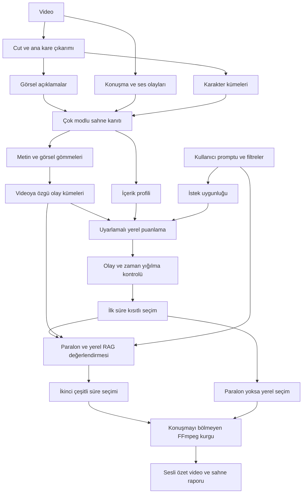

# SceneMind Sahne Seçim Sistemi — Son Durum

## 1. Kısa sonuç

SceneMind artık bir videoya three-act, kahraman yolculuğu veya sabit dönüm
noktaları dayatmaz. Sistem, videonun kendi görsel, işitsel, metinsel ve karakter
sinyallerinden olay kümeleri çıkarır; kullanıcı isteğine uyan, yeni bilgi taşıyan
ve birbirini gereksiz tekrarlamayan sahneleri süre bütçesine yerleştirir.

Son tasarımın temel ilkeleri şunlardır:

1. Kullanıcının serbest metin isteği en önemli seçim sinyallerinden biridir.
2. Sahne konumu tek başına anlatısal önem anlamına gelmez.
3. Zaman çizelgesi yalnızca aşırı yığılmayı azaltmak için kullanılır.
4. Bağlam korunur fakat aynı olayın benzer görüntüleri özeti ele geçiremez.
5. İçerik tipi kesin bir tür hükmü olarak değil, puan ağırlıklarını değiştiren
   gözlenebilir bir profil olarak kullanılır.
6. Paralon çalışmasa bile yerel seçim motoru eksiksiz çalışmaya devam eder.

## 2. Güncel işlem akışı



## 3. Kullanıcı tarafından yönetilen seçim

Arayüz şu girdileri sunar:

- Serbest metin özet isteği.
- Aksiyon, konuşmalı, konuşmasız ve müzikli sahne tercihleri.
- Ana karakter veya yan karakter odağı.
- Belirli oyuncu adları veya yerel oyuncu kimlikleri.
- Yalnızca tercihlere uyan sahneleri kullanmak için kesin filtre.

Örnek istekler:

```text
Sadece araba kovalamacalarını ve sonuçlarını kullan.
Ana karakterin yalnız kaldığı sessiz sahnelerden atmosferik bir özet oluştur.
Oyuncu 2 ile Oyuncu 4 arasındaki tartışmaları göster.
Komik setup ve punchline birlikteliğini bozma.
Filmin genel hikâyesini, tekrar eden görüntüleri azaltarak anlat.
```

`sadece`, `yalnız`, `yalnızca` veya `only` ifadeleri kesin filtreyi otomatik
olarak etkinleştirir. Kesin filtre kullanılmıyorsa istek bir tercih bonusudur;
diğer güçlü sahneleri mutlak biçimde yasaklamaz.

## 4. Olay kümeleri

Bitişik kamera cut'ları daha üst düzey olay kümelerinde birleştirilir. Devamlılık
değeri şu sinyallerden oluşur:

```text
devamlılık = metin benzerliği × 0.52
            + görsel benzerlik × 0.25
            + karakter örtüşmesi × 0.23
```

Jenerik durumunun değişmesi, yeterli süre sonunda devamlılığın düşmesi veya
kümenin aşırı uzaması yeni olay sınırı oluşturabilir. Bu kümeler klasik perde
ya da senaryo aşaması değildir; yalnızca videoda gözlenen yerel devamlılığı
temsil eder.

Olay sınırı puanı, mevcut sahnenin önceki ve sonraki sahneden anlamsal/görsel
olarak ne kadar değiştiği ve kümenin başında veya sonunda bulunup bulunmadığı
üzerinden hesaplanır. Videonun belirli yüzdelerinde bulunduğu için otomatik
bonus verilmez.

## 5. İçerik profilleri

Sistem videoya kesin bir tür etiketi vermez. Konuşma oranı, hareket, müzik,
sessizlik, görsel değişim ve karakter dağılımından aşağıdaki çalışma
profillerinden birini çıkarır:

| Profil | Diyalog | Ses | Karakter | Görsel değişim | Özgünlük | Olay yapısı |
|---|---:|---:|---:|---:|---:|---:|
| Hareket ve eylem ağırlıklı | 12 | 23 | 12 | 23 | 18 | 12 |
| Atmosfer ve görsel motif ağırlıklı | 8 | 16 | 10 | 24 | 30 | 12 |
| Çok karakterli / paralel hatlı | 21 | 12 | 25 | 10 | 20 | 12 |
| Diyalog ve ilişki ağırlıklı | 31 | 11 | 16 | 8 | 22 | 12 |
| Karma / şablonsuz | 24 | 16 | 16 | 12 | 21 | 11 |

Her satır 100 puandır. Profil yalnızca ağırlıkları değiştirir. Örneğin
atmosferik profilde sessiz ama görsel olarak farklı sahneler sırf diyalog
içermediği için değersiz sayılmaz. Çok karakterli içerikte tek bir yüzün bütün
özeti kaplaması yerine karakter dağılımı daha fazla önem kazanır.

## 6. Yerel sahne puanı

Her sahne için şu bileşenler hesaplanır:

- Konuşma yoğunluğu.
- Önemli ses olayı.
- Karakter görünürlüğü.
- Görsel değişim.
- Semantik özgünlük.
- Olay yapısı ve olay sınırı olasılığı.
- Kullanıcı isteğine uygunluk.
- Jenerik olma olasılığı.

Kullanıcı isteği yoksa seçilen içerik profilinin 100 puanlık ağırlıkları
kullanılır. İstek varsa yerel bileşenlerin etkisi yüzde 65'e ölçeklenir ve
kullanıcı niyeti en fazla 35 puan ekler:

```text
istekli puan = yerel içerik puanı × 0.65 + istek uygunluğu × 35
son puan     = istekli puan × (1 - jenerik olasılığı)
```

Serbest prompt uygunluğu çok dilli metin gömmeleriyle hesaplanır. Yerel gömme
modeli kullanılamazsa karakter n-gram TF-IDF geri dönüşü devreye girer.

## 7. Tekrar ve bağlam dengesi

Eski yaklaşımda aynı hikâye grubundaki üçüncü cut'tan itibaren doğrudan ceza
uygulanıyordu. Güncel yaklaşımda aynı olay kümesinde olmak tek başına ceza
sebebi değildir.

Ceza için iki cut'ın metinsel ve görsel olarak gerçekten benzer olması gerekir:

```text
benzerlik = metin benzerliği × 0.78 + görsel benzerlik × 0.22
```

- Diyalog ve genel bağlam yapılarında ilk iki temsilciye kadar ceza verilmez.
- Aksiyon zincirlerinde ilk üç temsilciye kadar ceza verilmez.
- Sonraki benzer cut'larda ceza giderek artar.
- Anlam, bakış açısı, motif veya bilgi değişiyorsa aynı kümedeki sahne korunabilir.
- En yüksek tekrar cezası yüzde 55'tir.

Bu davranış; neden-sonuç, soru-cevap ve setup-punchline gibi gerekli bağları
korurken aynı kovalamacanın veya aynı konuşmanın çok benzer parçalarının özeti
doldurmasını engellemeyi amaçlar.

## 8. Esnek zaman dağılımı

Sabit three-act kotası tamamen kaldırılmıştır. Video yalnızca yoğunlaşma
kontrolü için on eşit zaman penceresine ayrılır.

- Her pencereden sahne seçme zorunluluğu yoktur.
- Zayıf bir başlangıç, orta veya final bölümü kota doldurmak için kullanılmaz.
- Bir zaman penceresi seçilen sürenin yaklaşık yüzde 34'ünü aşarsa fazladan
  sahneler yumuşak biçimde değer kaybeder.
- Tek bir olay kümesi seçilen sürenin yaklaşık yüzde 28'ini aşarsa benzer biçimde
  azalan getiri uygulanır.
- Bunlar sert yasak değildir; yeterince güçlü içerik yine seçilebilir.
- Kullanıcının kesin zaman veya olay isteği içerik uygunluğu üzerinden öncelik
  kazanır.

Seçim, değiştirilmiş değerlerle en fazla beş kez süre kısıtlı Knapsack hesabını
yeniler. Böylece sistem boş bir bölgeyi doldurmak yerine gerçek seçimin nerede
yığıldığına tepki verir.

## 9. Paralon ve RAG değerlendirmesi

İlk yerel seçimin tamamı Paralon aday havuzuna girer. Ayrıca komşu cut'lar,
yüksek puanlı adaylar, olay kümesi temsilcileri ve zaman çizelgesinden güçlü
örnekler eklenir.

Paralon'a şu bilgiler gönderilir:

- Kullanıcı isteği ve kesin filtre bilgisi.
- Gözlenen içerik profili.
- Cut zamanı ve süre maliyeti.
- Görsel açıklama.
- Karakterler.
- Kısa konuşma parçaları.
- Ses olayları.
- Olay kümesi kimliği.
- Yerel algoritma puanı.
- RAG tarafından bulunan ilişkili cut'lar.

Paralon talimatı özellikle klasik üç perde veya Hollywood dönüm noktaları
dayatmamasını söyler. İçeriğe göre karakter hattı, setup-punchline, eylem
değişimi, atmosfer ve motif çeşitliliği gibi ilişkileri değerlendirmesi istenir.

Paralon'un değerlendirdiği adayın karma puanı:

```text
karma puan = yerel puan × 0.42 + Paralon önceliği × 0.58
```

Paralon'un yanıtında yanlışlıkla atladığı aday sıfır puan almaz; yerel puanı
korunur. İkinci süre seçimi de olay ve zaman çeşitliliği denetiminden geçer.
Paralon çağrısının tamamı başarısız olursa ilk yerel seçim aynen kullanılır.

## 10. Özet videonun oluşturulması

Seçilen cut'lar kaynak videodaki kronolojik sırada birleştirilir. Bir kesim
noktası algılanmış konuşmanın içine denk geliyorsa başlangıç veya bitiş sınırı
konuşmayı tamamlayacak şekilde genişletilir.

Kaynakta ses kanalı varsa FFmpeg hem görüntüyü hem sesi kesip birleştirir:

- Video: H.264.
- Ses: AAC.
- Web oynatma: fast-start MP4.

Kaynakta ses yoksa yalnız görüntü çıkışı üretilir. Sesin bulunup bulunmadığı
önbellekteki WAV dosyasından değil, doğrudan kaynak video konteynerinden
`ffprobe` ile kontrol edilir.

## 11. İncelenen literatür

### Anlatı yapısı ve dönüm noktaları

**Movie Plot Analysis via Turning Point Identification** çalışması, TRIPOD
verisinde beş dönüm noktasının teorik ve gözlenen konumlarını inceler. Çalışma,
konumun yararlı bir ön bilgi olabileceğini fakat özellikle orta dönüm
noktalarında geniş sapmalar bulunduğunu gösterir. Bu nedenle sabit yüzdeler
evrensel kural olarak kullanılmamıştır.

- [Papalampidi, Keller ve Lapata — EMNLP-IJCNLP 2019](https://aclanthology.org/D19-1180/)

**Screenplay Summarization Using Latent Narrative Structure**, yalnızca belge
başına veya konuma dayalı seçimin uzun anlatılarda eksik kaldığını; önemli
olayların ve anlatı yapısının daha eksiksiz, çeşitli özetler üretebildiğini
gösterir. Proje bu bulgudan olay sınırı fikrini alır ancak sabit screenplay
şablonunu genelleştirmez.

- [Papalampidi ve diğerleri — ACL 2020](https://aclanthology.org/2020.acl-main.174/)

### Three-act modelinin sınırları

Cutting'in popüler filmler üzerine ampirik incelemesi, filmlerin üç perde
dışında yaklaşık dört parçalı yapıyla da açıklanabildiğini; hareket, müzik,
konuşma, plan süresi ve sahne geçişlerinin film boyunca farklı örüntüler
gösterdiğini belirtir. Bu çalışma da tek bir şemanın bütün içeriklere
uygulanmaması kararını desteklemiştir.

- [Cutting — Narrative theory and the dynamics of popular movies, 2016](https://pubmed.ncbi.nlm.nih.gov/27142769/)

### Önem, ilerleme ve çeşitlilik

Graph-based screenplay summarization çalışması iyi bir sahne zincirini üç
hedefle tanımlar: önem, hikâye ilerleyişi ve çeşitlilik. Güncel yerel seçimde
olay bağlantısı ile tekrar cezasının birlikte kullanılmasının temel dayanağıdır.

- [Gorinski ve Lapata — NAACL 2015](https://aclanthology.org/N15-1113.pdf)

SeqDPP çalışmaları, video özetinde yalnızca en yüksek bağımsız puanları almak
yerine seçilen kümenin çeşitliliğini ve kullanıcının beklediği özet uzunluğunu
birlikte modellemektedir. Projede DPP doğrudan uygulanmamıştır; azalan getiri ve
süre kısıtlı çeşitli seçim aynı tasarım ihtiyacına daha hafif bir çözüm sunar.

- [Sharghi ve diğerleri — ECCV 2018](https://openaccess.thecvf.com/content_ECCV_2018/html/Aidean_Sharghi_Improving_Sequential_Determinantal_ECCV_2018_paper.html)

### Kullanıcı isteğine göre video özeti

Query-focused video summarization, tek bir genel özetin bütün kullanıcı
beklentilerini karşılamayacağını ve metin sorgusunun seçim sürecine katılması
gerektiğini gösterir. Serbest prompt ve açık sahne/karakter tercihleri bu
yaklaşımdan yararlanır.

- [Sharghi, Laurel ve Gong — CVPR 2017](https://openaccess.thecvf.com/content_cvpr_2017/html/Sharghi_Query-Focused_Video_Summarization_CVPR_2017_paper.html)
- [Wu ve diğerleri — IntentVizor, CVPR 2022](https://openaccess.thecvf.com/content/CVPR2022/html/Wu_IntentVizor_Towards_Generic_Query_Guided_Interactive_Video_Summarization_CVPR_2022_paper.html)

### Olay sınırları ve insan algısı

Doğal film izleme çalışmalarında izleyicilerin zaman, mekân, karakter ve amaç
değişimlerinde olay sınırları algıladığı; bu sınırların bellek ve olay
anlamlandırmayla ilişkili olduğu gösterilmiştir. Bu sonuç, sabit perde yerine
yerel içerik değişimlerinden olay kümeleri çıkarma kararını destekler.

- [Zacks ve diğerleri — The Brain's Cutting-Room Floor, 2010](https://pmc.ncbi.nlm.nih.gov/articles/PMC2955413/)
- [Constructing experience: Event models from perception to action, 2017](https://pmc.ncbi.nlm.nih.gov/articles/PMC5694361/)

## 12. Literatürden doğrudan alınmayan mühendislik kararları

Aşağıdaki değerler makalelerde evrensel doğrular olarak verilmemiştir. Bunlar
mevcut sistem, süre bütçesi ve kullanıcı ihtiyaçları için seçilen ayarlanabilir
mühendislik başlangıçlarıdır:

- İçerik profillerindeki kesin puan ağırlıkları.
- Kullanıcı isteğinin yüzde 35 etkisi.
- Paralon ve yerel puanın yüzde 58 / yüzde 42 birleşimi.
- On zaman penceresi.
- Yüzde 34 zaman yoğunlaşma ve yüzde 28 olay yoğunlaşma eşikleri.
- İki genel veya üç aksiyon temsilcisinin cezasız kalması.
- Yüzde 55 azami tekrar cezası.

Bu parametreler ileride insan değerlendirmesiyle kalibre edilmelidir.

## 13. Özellikle kaldırılan eski varsayımlar

- Her videoya zorunlu `%25 / %50 / %25` three-act dağılımı.
- `%10 / %25 / %50 / %75 / %92` konumlarına otomatik önem bonusu.
- Başlangıç, orta ve son bölümün her birinden zorunlu sahne seçimi.
- Aynı olay kümesindeki üçüncü cut'a benzerlik ölçmeden otomatik ceza.
- Paralon'a kurulum, kriz ve sonuç aşamalarını her içerikte arama talimatı.

Bu varsayımlar klasik hedef odaklı filmlerde bazen yararlı olsa da dizi,
sitcom, skeç, belgesel, sanat filmi, epizodik ve doğrusal olmayan içeriklerde
yanlış seçimlere yol açabileceği için sistemin merkezinden çıkarılmıştır.

## 14. Doğrulama durumu

Son değişikliklerden sonra:

- Python sözdizimi kontrolleri geçti.
- Toplam **19/19 otomatik test** geçti.
- Zayıf bir zaman aralığından zorunlu sahne seçilmediğini doğrulayan test eklendi.
- Tek olay kümesinin özeti ele geçirmesini önleyen test eklendi.
- Aksiyon ve atmosfer profillerinin ayrılmasını doğrulayan test eklendi.
- Paralon'un atladığı adayın yerel puanını koruduğu test edildi.
- 390 cut'lık gerçek önbellek üzerinde yerel kuru çalışma gerçekleştirildi.
- Bu çalışmada içerik çok karakterli/paralel hatlı olarak profillendi ve seçilen
  sahneler 33 farklı olay kümesine yayıldı.

Canlı Paralon çağrısı bu son doğrulamada tekrar ücretlendirilmemiştir; Paralon
akışı sahte yanıtlarla entegrasyon testinden geçirilmiştir.

## 15. Bilinen sınırlar

- İçerik profili gözlenebilir sinyallere dayalı sezgiseldir; gerçek tür veya
  yönetmen niyetini kesin olarak bilemez.
- Komedi setup-punchline ilişkisi yerel olarak tam eğitilmiş özel bir modelle
  çözülmez; prompt, diyalog, olay kümesi ve Paralon değerlendirmesinden yararlanır.
- Olay kümeleri ağırlıklı olarak bitişik sahneleri birleştirir. Filmin başında
  kurulan ve çok sonra dönen motifler RAG ve gömme benzerliğiyle bulunabilir,
  fakat kusursuz uzun vadeli anlatı grafiği henüz yoktur.
- Çok düşük kaliteli görsel açıklama veya konuşma çözümlemesi seçim kalitesini
  düşürebilir.
- Belirlenen eşikler insan tercih testiyle geniş ölçekte kalibre edilmemiştir.
