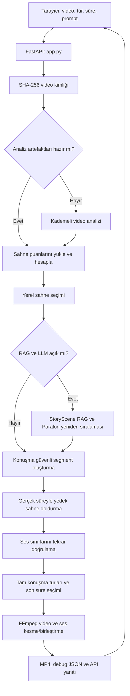
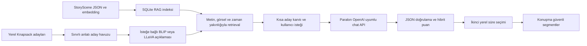

# Thanos mimarisi ve çalışma akışı

Bu belge `thanos/` dizinindeki **mevcut kodun** bir videoyu nasıl analiz edip özet MP4'e dönüştürdüğünü anlatır. Thanos, Gökdeniz'in CineSum analiz/StoryScene/RAG hattını ve Samet'in içerik odaklı çeşitlilik seçimi, tam konuşma turu koruması, yüz-konuşmacı eşleştirmesi ve sesli video kesimini bir araya getirir. `samet/` ve `gokedniz/` kaynak dizinleri çalışma sırasında değiştirilmez. Nezihat'ın ayrı Whisper katkısı henüz bu hatta bağlı değildir.

## Bir bakışta

Burada iki ayrı işlem vardır: **analiz** pahalı özellikleri video başına üretip saklar; **özet seçimi** aynı özelliklerden farklı tür, süre veya prompt için yeniden çalışır. Video dosyası aynıysa SHA-256 tabanlı kayıt ve aşama manifesti mevcut analizleri yeniden kullanabilir.

## Kodun sorumlulukları

| Bileşen | Ana görev |
|---|---|
| `app.py`, `static/app.js`, `templates/` | Yükleme, özet isteği, ilerleme sorgusu, sonuç arayüzü |
| `src/core/video_registry.py` | İçerik hash'iyle aynı videoyu tanıma ve alias verme |
| `src/core/analysis_pipeline.py` | Analiz aşamalarını sıralama ve yeniden kullanılabilir artefakt üretimi |
| `src/core/feature_manifest.py` | Kaynak hash'i, aşama yapılandırması ve üretilen dosyalar için önbellek geçerliliği |
| `src/scene_detection/`, `src/features/`, `src/audio/` | Cut, ana kare, CLIP, ses, Whisper, yüz/konuşmacı özellikleri |
| `src/story/story_scene_builder.py` | Ardışık cut'ları doğal olay/StoryScene gruplarına toplama |
| `src/scoring/scoring_engine.py` | Aksiyon, diyalog, önem ve jenerik puanları |
| `src/selection/` | Yerel süre bütçesi, MMR, Knapsack ve yumuşak çeşitlilik kontrolü |
| `src/rag/`, `src/llm/` | İsteğe bağlı StoryScene retrieval, görsel açıklama ve Paralon değerlendirmesi |
| `src/summary/` | Zaman aralıkları, konuşma güvenliği, süre bütçesi, son ASR denetimi ve MP4 dışa aktarımı |

## 1. İstek ve önbellek yaşam döngüsü

Tarayıcı `POST /api/upload` ile dosyayı yollar; `POST /api/summarize` isteğinde `video_alias`, `category`, `target_duration_sec`, `analysis_profile`, `narrative_mode` ve gerekirse `custom_prompt` gönderir. `GET /api/progress/{task_id}` ilerlemeyi, `GET /api/video-info/{video_alias}` mevcut sahne sonuçlarını getirir. Ağır senkron işler arka plan thread'inde yürür; aynı video için analiz kilidi bulunur. İlerleme durumu süreç belleğindedir; kalıcı iş kuyruğu değildir.

`video_registry.py` aynı içeriği dosya adından bağımsız SHA-256 ile tanır. `FeatureManifest` kaynak dosya hash'i, her aşamanın ayar hash'i ve artefaktların varlığını kontrol eder. Sadece geçersiz/eksik aşamalar yeniden üretilir. Özellikle taşınmış eski dizinlerde mutlak yol içeren eski kayıtların kendiliğinden doğru olduğunu varsaymamak gerekir; sistem mevcut dosyaları ve manifesti doğrular.

## 2. Video analizi: ham dosyadan sahne kanıtlarına

Analiz sırası `src/core/analysis_pipeline.py` içindedir:

1. **PySceneDetect:** Kamera kesmelerini ve zaman aralıklarını çıkarır (`outputs/pyscenedetect/scene_lists/`).
2. **Ana kareler:** Her cut için görsel örnekleri çıkarır (`outputs/pyscenedetect/keyframes/`).
3. **CLIP:** Ana kare embedding'lerini üretir (`outputs/features/visual/*.npy` ve metadata JSON).
4. **FFmpeg + Faster-Whisper:** Sesi 16 kHz mono WAV'a ayırır; zaman kodlu, kelime düzeyinde transkript üretir. Uzun/anormal bloklar ayrıca onarılır (`outputs/features/audio/*_transcript_raw.json`, `*_transcript.json`). `fast` ve `balanced` profilleri `small`, `quality` profili `medium` Whisper kullanır.
5. **İsteğe bağlı Samet yüz/konuşmacı katmanı:** Yüzleri ve ses kümelerini yaklaşık karakter/konuşmacı kimliklerine bağlar (`*_people.json`). `THANOS_ENABLE_PEOPLE=false` ile kapatılabilir; özetleme çekirdeği çalışmayı sürdürür.
6. **Sahne başına ses özellikleri:** Enerji, konuşma oranı, kelime sayısı ve transkriptleri cut zamanlarına eşler (`*_audio_features.json`).
7. **StoryScene:** Komşu cut'ların görsel, metinsel, konuşma ve zamansal devamlılığını kullanarak daha büyük doğal olay kümeleri ve embedding'ler oluşturur (`outputs/features/story/`). Devamlılık ağırlıkları sırasıyla 0,52 / 0,28 / 0,12 / 0,08'dir; bir küme en fazla 45 saniye ve 12 cut ile sınırlandırılır.

Bir **cut**, kamera kesimiyle tanımlanan teknik birimdir. Bir **StoryScene**, yakın ve ilişkili cut'ların anlatı birimidir. StoryScene seçimin ve RAG'in bağlamını sağlar; son MP4 ise yine kaynak videonun gerçek zaman aralıklarından kesilir.

## 3. Puanlama ve kullanıcı isteği

`compute_scene_scores_for_video()` CLIP benzerlikleri, ses enerjisi, cut sıklığı, konuşma yoğunluğu, anlatı/duygu sinyalleri ve karakter bilgilerini birleştirir. Aksiyon puanı kabaca görsel aksiyon (%40), ses enerjisi (%35) ve kesme sıklığı (%25); diyalog puanı konuşma oranı (%45), görsel diyalog sinyali (%30) ve transkript yoğunluğu (%25) kullanır. Önem puanı içerik sinyallerinden gelir; yalnızca filmin başında/sonunda diye otomatik önem verilmez. Yüksek jenerik olasılıklı cut'lar bütün özet türlerinden çıkarılır.

Arayüzdeki dört seçim yolu:

| Tür | Seçimin ana sinyali |
|---|---|
| `action` | Aksiyon puanı ve sahne devamlılığı |
| `dialogue` | Konuşma/diyalog puanı ve tam replik |
| `importance` | Anlatısal önem; varsayılan olarak içerik uyarlamalı dağılım |
| `custom` | Kullanıcının metin prompt'unun CLIP vektörü ile kare benzerliği |

`custom` yolu prompt'u ve nötr bir referans metni CLIP ile karşılaştırır; çıkan sahne benzerlikleri aynı segment oluşturucusuna gider. `narrative_mode=local` tamamen yereldir; `rag_llm` ek yeniden sıralama ister. Süre sıfır ise arayüzün “tümünü seç” anlamına gelir; sunucu bunu sınırsız seçime çevirir.

## 4. Yerel seçim ve olay dağılımı

Yerel seçim önce cut puanlarını zamansal olarak yumuşatır, düşük kanıtlı adayları ayıklar. Ardından süre tahmini, MMR benzerlik cezası ve 0/1 Knapsack ile bir ilk küme oluşturur. Aynı StoryScene'den fazla sayıda neredeyse aynı cut alınmaması amaçlanır.

Varsayılan `importance/adaptive` modunda Samet'ten uyarlanan seçim kullanılır: sabit üç perde kotası yoktur. Film 10 zaman penceresine ve olay gruplarına bakılır; tek pencereye bütçenin %34'ünden, tek olaya %28'inden fazla yığılma varsa fazlalık **yumuşak puan cezası** alır. Bu, boş/zayıf bir bölgeden zorla sahne almak değildir. Kodda ayrı `three_act` seçeneği vardır; varsayılan akış değildir. `action`, `dialogue` ve `custom` ilk seçiminde Gökdeniz'den gelen bölge kotaları ile MMR/Knapsack devam eder; kısa isteklerde daha kompakt bölge şeması kullanılır.

İlk Knapsack süresi **tahmindir**: komşu cut'lar birleştirilince, konuşma sınırları genişletilince ve güvenli kesim yapıldığında gerçek uzunluk değişir. Bu nedenle ilk seçim sonucu doğrudan MP4'e gönderilmez.

## 5. İsteğe bağlı RAG ve Paralon katmanı

Bu katman yalnız `narrative_mode=rag_llm` ve geçerli `PARALON_API_KEY` olduğunda devreye girer. Akış şöyledir:

RAG indeksi `StoryScene` başına bir belge tutar: zaman, cut kimlikleri, baskın mod ve transkript. Metin için 512 boyutlu deterministik hashing vektörü, görsel için StoryScene embedding'i kullanılır. Retrieval puanı metin benzerliği **0,70**, görsel benzerliği **0,25** ve zaman yakınlığı **0,05** ağırlıklıdır. Her aday için ilgili en fazla iki bağlam belgesi eklenir; isteğe bağlı BLIP/LLaVA açıklaması somut görsel kanıt sağlar.

Paralon'a videonun kendisi veya yerel dosya yolları değil, sınırlı aday kanıtları ve seçim isteği gönderilir. Sunucu `POST {PARALON_BASE_URL}/chat/completions` çağrısını Bearer anahtarıyla yapar; anahtar tarayıcıya verilmez. Model ve adres ortamdan ayarlanır (`PARALON_MODEL`, `PARALON_BASE_URL`); kodun varsayılan modeli `gemma3-4b-mac` değeridir. Yanıtın öneri kimlikleri/biçimi doğrulanır; LLM puanı yerel puanla karıştırılır ve süreye uyan son seçimi yine yerel algoritma yapar. İstek+kaynak+model hash'iyle LLM sonucu önbelleğe alınır. Anahtar yoksa, zaman aşımı/HTTP/yanıt sorunu varsa **yerel seçim korunur**. LLM karar verirken ses/Whisper/FFmpeg araçlarını doğrudan çalıştırmaz.

## 6. Seçilen cut'lardan tam süreli, konuşması sağlam özete

Bu bölüm `src/summary/temporal_segment_builder.py`, `speech_boundaries.py`, `samet_speech_guard.py`, `targeted_asr.py` ve `summary_exporter.py` arasındaki iş bölümüdür:

1. İlk seçilen cut'a türüne göre giriş/çıkış bağlamı eklenir, kamera kesimi sınırına oturtulur ve yakın/örtüşen aralıklar birleştirilir.
2. Whisper kelimelerinden cümle/replik sınırları çıkarılır. Görsel cut konuşmanın ortasına denk geldiyse aralık tam repliğe genişletilir; eksik replik yüzünden bütün aksiyon adayını hemen atmak yerine onarmak denenir.
3. Samet'in transkriptteki **tam konuşma turu** sınırı segment bütçe optimizasyonundan **önce** uygulanır. Böylece son seçici tahmini cut süresi yerine dışa aktarılacak gerçek güvenli süreyi bütçeye yazar.
4. İlk adayların gerçek toplamı kısa kalırsa, seçilmemiş ama yeterince puanlı cut'lar arasından örtüşmeyen yedekler hazırlanır. Yedeklere de tam konuşma güvenliği uygulanır; Samet'in yumuşak zaman/olay çeşitliliği seçimiyle sıralanıp Gökdeniz'in ilk/LLM seçimlerinin arkasından bütçeye eklenir. Örtüşen aralıkların maliyeti toplama değil, birleşmiş gerçek süreye göre hesaplanır.
5. `summary_exporter.py` son seçilen konuşma kenarlarını kısa, VAD kapalı bir ses tekrar kontrolüyle doğrular. `importance` türünde ayrıca sessiz görünüp kritik olabilecek sınırlı sayıdaki sahne için hedefli ASR vardır. `custom` yolu aynı son kenar doğrulamasını değil, kendi konuşma korumasını kullanır.
6. Son Samet koruması replikleri kesmeden genişletir. Süre aşılırsa klipleri rastgele veya yalnız düşük puan yoğunluğuna göre silmez; **tam aralıklarla** süreye en çok yaklaşan alt kümeyi seçer, eşit dolulukta daha yüksek puanlıları korur. Hedefi aşmaz. Tam konuşma turları bütçeye sığmıyorsa açık hata verir; uygun içerik azsa hedefe tam ulaşmayı garanti etmez.
7. FFmpeg kaynak MP4'ten seçilen zaman aralıklarını `trim` ve `atrim` ile aynı geçişte keser, `concat` ile kronolojik birleştirir, H.264 video ve varsa AAC ses üretir. Ses ayrı bir sonradan ekleme işlemi değildir.

Kısacası istenen süre bir **sert üst sınırdır**, ama artık gerçek uzunluğa yaklaşmak için güvenli yedek adaylar ve son tam-aralık optimizasyonu vardır. İşlem konuşmayı yarıda kesip saniyeyi tamamlama uğruna bozuk özet üretmez. `summary_algorithm_version` şu anda `3.10.0`'dır.

## 7. Çıktılar, hata noktaları ve sınırlar

| Dosya/konum | İçerik |
|---|---|
| `dataset/video/{alias}.mp4` | Tekilleştirilmiş kaynak video |
| `outputs/manifests/{alias}.json` | Aşama durumu, yapılandırma hash'i, kaynak parmak izi |
| `outputs/pyscenedetect/` | Cut listesi ve ana kareler |
| `outputs/audio/{alias}.wav` | Whisper ve ses denetimi için PCM ses |
| `outputs/features/audio/` | Ham/onarılmış transkript, cut ses özellikleri, opsiyonel kişi eşleşmeleri |
| `outputs/features/visual/` | CLIP vektörleri ve kare metadata'sı |
| `outputs/features/story/` | StoryScene JSON ve embedding'ler |
| `outputs/features/rag/` | İsteğe bağlı SQLite RAG indeksi |
| `outputs/cache/llm/` | İsteğe bağlı Paralon yeniden sıralama önbelleği |
| `outputs/summaries/*.mp4` | Son sesli özet video |
| `outputs/summaries/debug/*_segments.json` | Seçim, reddedilen aralık, yedek dolgu, süre ve son koruma tanıları |

Sistem yalnız algılanan konuşma turlarını koruyabilir: Whisper konuşmayı kaçırır veya yanlış zamanlarsa otomatik güvence sınırlanır. Son ses kenarı doğrulaması bunu azaltır ama insan dinlemesinin yerini almaz. Çok dar özel prompt, tür filtresi veya uzun hedef için yeterli ilgili içerik yoksa süre yine kısa kalabilir; böyle bir durumda alakasız görüntüyle zorla doldurmak amaç değildir. Paralon dış ağ sağlayıcısıdır; `local` modda özet için gerekli değildir.

## 8. Doğrulama

Proje kökünden `cd thanos && ../.venv/bin/python -m pytest -q tests` ile testler çalıştırılır. Süre düzeltmesi sırasında aynı 1363,5 sn'lik kaynak videoda yerel aksiyon seçimi ve son konuşma koruması için 30 sn isteği yaklaşık **28,38 sn**, 365 sn isteği **360,96 sn**, 660 sn isteği **659,17 sn** üretti. Ek ses sınırı doğrulaması ve FFmpeg dahil uçtan uca 30 sn denemesinde gerçek MP4 **27,68 sn** oldu; hem video hem ses kanalı doğrulandı. Bu ölçümler tek videoya aittir, bütün türler için evrensel kalite/süre garantisi değildir.
